# Introduction à la mécanique

## Vocabulaire

## Connaissances générales

### Norme ISO

La norme ISO est un ensemble de standards techniques publiés par l'Organisation internationale de normalisation (ISO – International Organization for Standardization), une organisation non gouvernementale fondée en 1947, basée à Genève.

En Europe, la norme ISO domine. Il est donc conseiller de se baser dessus à Projet&Tech. Il est possible d'utiliser différentes normes pour les différents domaines électronique/mécanique, et ce n'est pas forcément bloquant.

### Moment ou Couple

On parle généralement de **moment** d'une force, car on cherche à calculer un bras de levier. Ce calcul dépend de la position de référence utilisé. Un moment associe donc un couple à une position dans l'espace.

Un **couple** en revanche ne dépend pas d'une position dans l'espace. Il provient donc des résultats de calculs après avoir considérer plusieurs moments, ou alors directement d'une sortie en rotation comme celle d'un axe moteur. On peut aussi parler de "moment résultant"

Cependant, ce sont des grandeurs homogène; il faut seulement vérifier le(s) point(s) d'application si on utilise des moments dans des calculs.

### Visserie

Il y a beaucoup de choses à dire sur les vis. En effet, il existe des livres de plusieurs centaines de pages, et de plusieurs volumes parlant des vis et de leur dimensionnement. Cette section aborde les notions fondamentales.

#### Vocabulaire

Tout d'abord, il est important de différencier les différents éléments associé à la visserie :

- **Vis** (EN - screw)  
- **Écrou** (EN - nut)  
- **Boulon** (EN - bolt)  
    Ensemble vis + écrou

Il existe différentes catégorie de vis :

- **Vis d'assemblage**

    Vis classique avec une partie fileté/taraudé, nécessitant un écrou pour être maintenu en place.

    La pression est exercée par la tête de la vis (ou l'écrou) sur la matière.

- **Vis de pression / de fixation**

    Vis ne nécessitant pas d'écrou. Peut généralement être directement vissé dans un matériau.

    La pression est exercée par le filatefe de la vis sur la matière.

    Un exemple répandu est les vis à bois.

    Il existe d'autres type de vis spécifiques à des applications bien particulière, comme les vis auto-taraudeuse, auto-foreuse, à molette, etc... 
    Normalement, elles ne sont pas utilisées en robotique.

!!! tip Remarque

    Il n'y a pas de nom spécial pour la "partie filetée qui dépasse" d'une vis à travers un matériau. Dans un domaine technique on parlerait de "filetage saillant" ou de "bout de vis saillant", mais on peut aussi parler de "queue de vis" ou de "bout de vis".

#### Écrous

Il existe différents type d'écrou :

- **Écrou "classique"**

    Écrou utilisé par défaut, permettant d'assembler deux pièces ensemble

    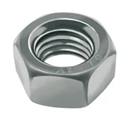

- **Écrou de bloquage**

    (ou écrou autobloquant) Écrou utilisé pour tenir des axes en rotation, ou résister au vibration. (Pensez-y c'est important)

    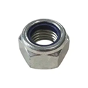

    Cet écrou a une bague de serrage (généralement en plastique bleu, parfois gris), ce qui le rend difficile à visser/dévisser. Il ne peut normalement pas se dévisser sans intervention.

- **Écrou papillon**

    (ou écrou à ailette)

    Écrou classique, mais avec des surfaces/poignées permettant un serrage à la main. Utile pour les éléments devant être monter/démonter fréquement ou rapidement.

    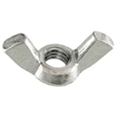

    (à noter: il est obligatoire d'en utiliser pour stabiliser le mat de balise à la Coupe (2025))

#### Tête de vis

Il y a 2 choses qui vont caractériser les différentes têtes de vis. La forme de la tête, et la forme de l'encoche.

**Le type de tête de vis :**

dans l'ordre :

- Fraisé
- Ronde
- Cylindrique
- Plate

Il existe aussi des vis sans encoche, le contour extérieur - généralement hexagonal - permet alors le serrage. On les appelle vis à entraînement externe.

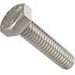

Vue d'une vis à tête hexagonale "vis hexagonale", à entraînement externe.

**La forme de l'encoche :**

- Fendue
- Cruciforme (ou Philips)
- Hexagonale creux (ou Allen)
- Étoilée (ou Torx)

[TODO - Ajouter une image]

Il existe beaucoup de type et de forme de tête de vis. Ceux non présenté s'apparente à une catégorie déjà existante, ou sont rares.

!!! note

    Les vis à tête hexagonale (vis "type hexagonale") ne sont pas la même chose que les vis à encoche/empreinte hexagonale (vis "hexagonale creux")

#### Convention de nommage

La convention la plus répandue pour le nommage des vis est la norme ISO. Les vis ont alors la désignation suivante :

> [Système d'unité][Diamètre]x[Longueur]x[Pas]

!!! example "Exemple : M3x20x0.5"

    M : métrique ou ISO métrique (à ne pas confondre avec isométrique).  
    La tige de la vis fait 3mm de diamètre et 20mm de long.   Chaque taille de vis (selon le diamètre) a une longueur de pas différent fixé par la norme ISO. Si la norme n'est pas utilisé, la longueur du pas est indiqué. Si le pas correspond à la norme, il n'est pas obligatoire de l'indiquer. Ici 0.5mm correspond à la norme, il est facultatif.

#### Taraudage

Le taraudage ou filetage est l'opération qui consiste à usiner un filet hélicoïdal dans un trou.  
L'opération s'effectue à l'aide de tarauds, et on obtient un trou taraudé.  
Il existe 2 variantes de taraudage : par déformation, et par enlèvement de copeaux.  
Pour un matériau dur, on effectue généralement un taraudage par enlèvement de copeaux. On utilise 3 tarauds différents, avec différentes profondeurs de filet, et on met une goutte de lubrifiant.  
Pour un matériau mou, un taraudage par déformation est recommandé, car plus lisse et résistant.  
Il existe des couples recommandés pour effectuer un taraudage, selon des tailles de trous différents.

Par convention, un filetage est toujours droit; c'est à dire qu'on serre en tournant dans le sens horaire. Les filetages gauches sont très rares, et donc toujours indiqué.

#### En Pratique

Il y as plusieurs choses à prendre en considérations lorsque l'on choisit une vis. Evidemment, il faut faire attention à la dimension.

!!! note
    Ne pas se fier aux dimensions indiquer sur les emballages, on ne sais pas à quelle partie de la vis correspondent ces mesures. Il y a possiblement des variations (~ 1mm max) surtout sur la longueur de la vis.

Mais l'autre chose à choisir c'est le type de vis utilisé. Si on souhaite serrer des composants dans du plastique, on peut utiliser une tête fraisé, grâce à sa forme en cône elle peut aider à stabiliser la tête de vis en place. De plus, on peu choisir d'enfoncer ou non la vis ce qui permet ajuster légèrement la longueur du bout qui dépasse.

À Projet&Tech, on a beaucoup de vis fraisée cruciforme, car la forme fraisée est avantageuse et que les têtes cruciforme sont généralement utilisées pour les vis fraisée.  
Voici ce qu'il faut savoir sur les encoches cruciforme :

- le négatif  
 Pour les encoches cruciforme ou fendue, le tournevis à tendance à ripper.  
 Pour les vis cruciforme, l'encoche de la vis à tendance à se dégrader rapidement si le tournevis n'est pas à la bonne taille ou si on serre trop.

- le positif  
  Le type de vis est très répendu, c'est facile de trouver du matériel; il y en avais aussi déjà beaucoup à Projet&Tech.  
  Un tournevis est plus pratique pour visser dans des zones confinés que les clés Allen.  
  On ne peut pas trop serrer les vis cruciforme, donc cela permet d'avoir un couple de serrage raisonnable.

### Engrenages

Il y a encore plus de choses à dire sur les engrenages que sur les vis. Cette section abordera les bases et principes des engrenages, en donnant une explication du vocabulaire spécifique à leur conception.  
Le but de cette section est de présenter les considérations pratique avant la modélisation et/ou l'assemblage d'un engrenage, et d'avoir une idée de comment les dimensionner. Elle doit aussi permettre d'introduire le vocabulaire afin de faciliter la compréhension des tutoriels en ligne.

#### Vocabulaire

Un engrenage est avant tout un système de transfert de mouvement et/ou de puissance. Ils sont très utilisés car constituent une solution solide.

Il existe aussi des normes pour les dimensions d'engrenage (norme ISO par exemple), ce qui permet de réduire les coûts dans l'industrie.

**Notations**

- $d$ : diamètre  
- $r$ : rayon  

- $\omega$ : vitesse en $rad.s^{-1}$  
- $N$ : vitesse en $tr.min^{-1}$  

- $M$ : couple (EN - Torque) en $kg.m$

- $Z$ : nombre de dent
    
##### Généralités

- **Engrenage**

    Ensemble de deux roues dentées engrenant l'une avec l'autre et permettant de transmettre une vitesse ou une puissance avec un rapport fixe.  
    Il est intéressant de noter qu'une roue - dentée - et qu'un engrenage ne sont pas la même chose.  
    En fonction du sens du montage, on parlera de roue menante (entrée) et de roue menée (sortie).

    Engrenage droit :

    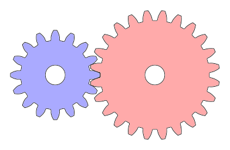  

- **Pignon**

    Roue avec le plus petit nombre de dent. Dans le contexte d'un engrenage, ou d'un train d'engrenage.

- **Crémaillère**

    Barre dentée, qui est équivalent à une roue de rayon infinie, et avec une infinité de dent. Dans le contexte d'un engrenage, la deuxième roue est donc le pignon.

    Pignon-Crémaillère

    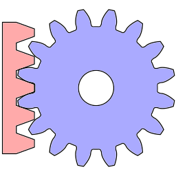  

- **Couronne**

    Roue avec denture intérieure.

    Si la couronne est mobile, cela permet de ne pas inverser le sens de rotation lors de la transmission. Cependant, le maintien en place de la couronne extérieure est alors difficile.  
    
    La couronne peut être fixe dans certains cas, comme dans un [train épicycloïdal](#dentures).

    Pignon-Couronne

    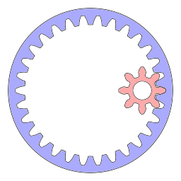  

- **Train d'engrenages**

    Une combinaison d'engrenage.  
    Donne naissance au vocabulaire "Train à étage", "Train épicycloïdale", etc...

##### Axes / Directions

- **Axiale** :

    Direction parallèle à l'axe de rotation de la roue

- **Radiale** :

    Direction permettant de définir le tracé du rayon.

- **Tangentiel** :

    Tangent au tracé de la roue dentée, orthogonal à la direction radiale.

##### Point de contact

Avant de passer à la suite, il est important de comprendre comment se déplace le point de contact sur une roue dentée.

Dans le cas d'un engrenage parallèle à denture droite, le point de contact se déplace selon une droite. C'est dans ce cas présent que le vocabulaire suivant est le mieux défini.

- **Droite de pression**

    Segment / Droite où évolue le point de contact de l'engrenage.  
    cf. \[[géométrie](#géométrie)\]

- **Point d'engrènement**

    Il y a 2 façon équivalente de le définir, ce qui change l'interprétation des prochaines définition.
    
    <!--TODO: voir chiffres romains-->

    1. Centre du segment associé à la droite de pression.   
    2. Point de croisement entre la droite de pression, et la droite reliant les deux centres d'un engrenage.

    Lorsque le point de contact est proche du point d'engrènement, il n'y a pas de glissement entre les dents. Plus on s'en éloigne, plus il y a de glissement.

- **Angle de pression**

    Cet angle sera noté $\alpha$.

    Il y a aussi 2 interprétations équivalentes possible :

    1. Angle de la droite de pression par rapport au plan tangent.  
    2. Angle de la dent au niveau du point d'engrènement, par rapport au plan radial.  
    
    C'est quelque chose qui est standardisé. Aujourd'hui il est de 20°, contre 14.5° avant.  
    Plus l'angle est petit, moins il y a d'effort radial. Le rendement est donc meilleur en théorie. La durée de vie de l'axe est meilleure.  
    Cependant, l'angle a été augmenter à 20° car l'effort radial reste gérable. Et, un engrenage à moins de chances de sauter une dent, ce qui est un phénomène assez grave, car endommage le mécanisme.  
    Un angle de pression de 20° permet aussi d'avoir des dents avec des formes plus triangulaires (moins rectangulaire que 14.5°), ce qui augmente la résistance générale d'un engrenage.

- **Contact Ratio**

    Souvent noté $\epsilon$.  
    C'est le rapport entre la distance entre 2 dents, mesuré sur le cercle de base et la longueur de la droite de pression.  
    Il correspond au nombre de dents moyen qui se touchent en même temps lors de la rotation.  
    Il faut $\epsilon > 1$ pour garantir qu'au moins une dents soit toujours en contact.

    $$\epsilon = \frac {
        \sqrt{r^2_{1_\text{tête}}-r^2_{1_\text{base}}}
        +\sqrt{r^2_{2_\text{tête}}-r^2_{2_\text{base}}}
        -\sqrt{
            (r_{1_\text{primitif}} + r_{2_\text{primitif}})^2
            -(r_{1_\text{base}} + r_{2_\text{base}})^2}}
    {p * cos(\alpha)}$$

    Vocabulaire associé à la définition : \[[variables](#variables)\]

##### Surfaces

Vocabulaire important :

- **Cercle primitif** (EN - pitch circle)

    Le cercle primitif a le même centre que l'engrenage auquel il est associé. (relation concentrique)  
    Il doit passer par le point d'engrènement.

- **Cercle de base** (EN - base circle)

    Concentrique avec la roue.  
    Le cercle est tangent avec la droite de pression.

    $$d_\text{base} = d_\text{primitif} * cos(\alpha)$$

- **Cercle de pied** (EN - dedendum circle)

    Cercle associé au diamètre minimum de la roue dentée.

- **Cercle de tête** (EN - addendum circle)

    Cercle associé au diamètre maximum de la roue dentée.

- **Cercle de dégagement** (EN - clearance circle)

    Cercle définit dans la convention AGMA. Il permet de faire la différence entre le cercle de pied avec et sans jeu.  
    Pour mieux comprendre : \[[hauteur des dents](#hauteur-des-dents)\] 

- **Saillie**

    Distance entre le cercle primitif et le cercle de tête.

- **Creux**

    Distance entre le cercle primitif et le cercle de pied.

Vocabulaire peu important :

- **Tête**

    Partie de la dent comprise entre le cercle de tête, et le cercle primitif.

- **Pied**

    Partie de la dent comprise entre le cercle de pied, et le cercle primitif.

- **Flanc**

    Flanc : Surface correspondant au côté de la dent.
    On définira aussi le "flanc de saillie" et le "flanc de creux".

    Le flanc de saillie est forcément convexe.

- **Fond**

    Surface associé à la distance entre le pied de 2 dents.

- **Sommet**

    Surface associé au dessus de la tête d'une dent.

- **Largeur de la denture**

    Épaisseur de la roue dentée/ de la roue, selon la direction axiale.

- **Épaisseur**

    Longueur d'arc associé à la largeur d'une dent, selon la direction tangente. Mesuré sur le cercle de base.

- **Intervalle**

    Longueur d'arc associé associé à l'écart entre deux dent, selon la direction tangente. Mesuré sur le cercle de base.

- **Entraxe**

    Distance "entre les axes" des deux roues d'un même engrenage.

##### Variables

- **Pas** (EN - circular pitch)

    Pas primitif : distance d'arc séparant deux centres de dent. Mesuré sur le cercle primitif, noté $p$.

    $$p = \frac{\pi \cdot d_\text{base}}{Z}$$

    C'est aussi la somme de l'épaisseur et de l'intervalle.

    Pour obtenir une roue dentée "normale", il faut que le pas soit un diviseur du périmètre du cercle; afin d'obtenir un nombre de dents entier.

- **Module**

    $m = \frac{p}{\pi}$ (en mm)  
    Il y a des valeurs de module normalisés.

    Généralement, lorsque l'on dimensionne un système, on préfère fixer le module plutôt que le pas, qu'un nombre de dent ou qu'un diamètre, car le module est directement utilisé dans le dimensionnement des dents d'engrenage.

    La division par $\pi$ a aussi l'avantage de simplifier les notations. En effet, la formule du périmètre d'un cercle : $P = 2*\pi * r$ fait intervenir pi. Lorsque l'on fixe $m = 1$, alors le pas est $p = \pi$.  

    L'avantage est qu'il est plus facile de vérifier que le module est un diviseur du diamètre, car c'est un nombre rationnel.

    Comme le module sert uniquement à faire du dimensionnement, on le définit toujours avec un pas en millimètres.

    Il est aussi possible de l'estimer avec la formule suivante :

    $$m = 2.34 \cdot \sqrt{\frac{F_T}{k \cdot R_\text{pe}}}$$

    où $F_T$ est l'effort tangentiel, $k$ est le coefficient de largeur de la denture, $R_\text{pe}$ la résistance pratique à l'extension du matériau

- **Diametral Pitch**

    Les américains utilisent les pouces pour dimensionner leur système. Et, ils utilisent encore des anciennes notions tel que le *Diametral Pitch*.  
    On peut le définir tel que :  
    $d_p = \frac{\pi}{p}$ (en pouces)  
    $d_p = \frac{25.4}{m.\pi}$  
    Comme pour le module, le *Diametral Pitch* n'est définit que pour des valeurs de p en pouces.

- **Rapport de Réduction**

    Les rapports de réductions sont notés de la façon suivante :

    $$Z_\text{mené} : Z_\text{menant}$$

    On préfère généralement écrire le quotient de façon explicite plutôt que de le calculer ou de le simplifier.  
    
    Parfois, on les notes aussi avec des vitesses, mais c'est moins courant.

#### Condition d'engrènement :

Il faut que le ratio "diamètre / nombre de dent" des deux roues soit égale. C'est équivalent à avoir une relation d'égalité sur le pas ou le module.

Pour deux roues en contact sans glissement, on a :

$$\frac{\omega_2}{\omega_1}=\frac{r_1}{r_2}=\frac{Z_1}{Z_2}=\frac{M_1}{M_2}$$

Pour la suite, on se limitera au cas le plus simple, pour un engrenage de type parallèle, à denture droite.

Un problème que l'on rencontre souvent sur les engrenages est qu'il y a des défauts sur les dents des roues. C'est quelque chose à prendre en compte lorsque l'on choisit le nombre de dent de chaque roue dentée.  
En effet, pour augmenter la longévité du système, on peut faire en sorte que les dommages liées au défauts soient répartit sur le plus grand nombre de dents possible. Pour cela, on choisit des nombres de dents qui n'ont pas de diviseurs commun.  
Par exemple, si on a un engrenage 12:24, on a un diviseur commun de 2; donc à chaque tour, les mêmes dents de la roue 1 entrent en contact avec les mêmes dents de la roue 2.  
Un engrenage 12:25 ou 12:23 serait beaucoup plus pertinent.

#### Géométrie

Problématiques : Comment définir le profil d'une dent d'engrenage ? Comment introduire du jeu afin de ne pas être sur-contraint ?

##### Hauteur des dents

Pour que les dents engrènent bien, il faut que la géométrie du creux soit adapté. En effet, on ne veut pas que les dents de la roue 1 frottent sur le creux d'une roue 2. On introduit donc un jeu sur la hauteur de creux.

Généralement on fixe (norme ISO) :

$$h_\text{saillie} = m$$

$$h_\text{creux} = m * 1.25$$

$$h_\text{dégagement} = h_\text{creux}$$

Sinon on fixe (norme AGMA) :

$$h_\text{saillie} = m$$

$$h_\text{creux} = m$$

$$h_\text{dégagement} = m+c$$

$$c = 0.167$$

Ces distances sont définies par rapport au cercle primitif.  
Ces définitions sont en réalité équivalente, mais proviennent de deux point de vue différents. La norme ISO inclus le jeu dans la définition du cercle de pied. La norme AGMA ne le fait pas, car elle considèrent que c'est une valeur libre de choix; même si typiquement fixée à c = 0.167. La terminologie diffère aussi légèrement.  
En prenant un diamètre minimum $1.25 \cdot m$ ou  $1.167 \cdot m$, les définitions se croisent.

##### Profil des dents

La forme du profil d'une dent d'engrenage parallèle à denture droite, est une courbe involute, aussi appelée dans le contexte des engrenages développante de cercle. (courbe à développante de cercle = les normales sont tangentes au cercle).

Il y a deux approches possible, la première étant plus ressemblante aux calculs effectués.

1. On peut la visualiser comme la trajectoire suivie par un point situé à l'extrémité d'un fil tendu que l'on déroule le long du cercle de base, sans glisser.  
2. C'est la courbe que tracerait un point sur le bord d'une roue lorsqu'elle roule sans glisser sur une ligne droite. 

Cette forme particulière permet que le point de contact se déplace linéairement (suivant une droite), et donc d'éviter des chocs liés aux changements d'accélérations. La transmission est alors théoriquement parfaitement fluide. De plus, elle garantit un rapport de transmission constant, indépendant de l'angle d'engrènement entre les dents (parallèle à la section [point de contact](#point-de-contact)).

$$x(t) = (d_\text{base} / 2) * (cos(t) + t(sin(t)))$$

$$y(t) = (d_\text{base} / 2) * (sin(t) - t(cos(t)))$$

Les termes $cos(t)$, $sin(t)$ correspondent à la position sur le cercle de base. Les termes $t \cdot sin(t)$, $t \cdot cos(t)$ correspondent au "déroulement du fil" / à la courbe involute.

Cette équation correspond à la courbe involute du cercle de base, dont l'origine (t=0) - c'est à dire le point de rebroussement - se situe sur le cercle de base.

Cette équation permet de définir la forme du contour du haut de la dent. En effet, elle n'est utile que pour la section allant du cercle de base jusqu'au cercle de tête.

Pour la section allant du cercle de pied jusqu'au cercle de base, si il y a suffisamment de dents ($Z$ > $Z_\text{min}$), alors on prolonge la courbe involue. Sinon, ($Z$ < $Z_\text{min}$), alors on amincit le pied de la dent. Amincir la dent a deux conséquences :

- le pied de la dent est fragilisé
- peut créer un point de contact prolongé
 
On parle surplomb (FR) ou d'undercut (EN)

!!! example "Engrenage avec roue rouge surplombée"

    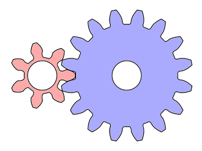

Il se pose aussi la question de comment introduire un jeu. Un effet, un tel assemblage est sur-contraint/hyperstatique.  
Typiquement, on commence par calculer/fixer la distance entre-axe de jeu maximale. Ce qui nous permet ensuite de calculer $Z_\text{min}$  
Voir [annexe](#cours-engrenage) (Involute Gears 3: Contact Ratio).

Pour une crémaillère, qui peut être vue comme un engrenage de rayon infini, la courbe involute se transforme en une droite (zoom infini). Cette droite est incliné selon l'angle de pression, mesuré par rapport à une direction radiale, passant par le point de rebroussement. Les dents sont donc triangulaire.

 

Cette propriété permet une manière peu coûteuse de fabriquer des roues dentées, grâce à l'utilisation de crémaillères. Pour un outil, on doit définir le module $m$ et l'angle de pression $\alpha$. Si on fixe $\alpha = 20°$, et qu'on choisit un module parmi les modules normalisés, alors le nombre d'outil nécessaire pour couvrir une norme est raisonnable.

##### Résumé

Le profil des dents d'un engrenage droit est une courbe involute, tracée à partir du cercle de base. Cette forme garantit un rapport de vitesse constant, avec un point de contact qui se déplace de façon linéaire, assurant un engrènement sans chocs ni vibrations.

Pour garantir un fonctionnement fiable, deux types de jeux sont introduits :

- **Le jeu entre-axe** qui correspond à la tolérance sur la distance entre les centres des roues, évitant un contact excessivement serré.

- **Le jeu de pied**, qui laisse un espace au niveau des creux pour empêcher les dents d'une roue 1 de frotter sur la base des dents d'une roue 2.

Ces jeux sont essentiels pour assurer un engrènement durable.

#### Types de transmission

Il y a 3 grosse catégorie d'engrenage :

- **Engrenages parallèles** (à axe parallèle)

    !!! example

    	engrenage à denture droite, hélicoïdale, à double hélice, etc...

- **Engrenages concourants** (les axes de rotation se croisent)

    ex : engrenage conique

    Généralement utilisé pour des liaisons à 90°, mais existe pour tout angle.

- **Engrenages gauches** (axes dans des plans distincts)

    ex : roue et vis sans fin

    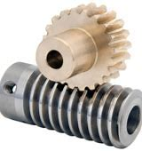 

    !!! note
        
        Un ensemble "roue et vis sans fin" / "engrenage à vis" (FR) ou "wormgear" (EN) ne peut transmettre de la puissance que dans le sens $\text{vis} \rArr \text{roue}$. Il est très difficile de transmettre la puissance dans le sens $\text{roue} \rArr \text{vis}$. Cependant, il existe des système avec des billes pour réduire les frottements, et le rendre inversible.

Comme la crémaillère est considéré comme une roue de rayon infinie, une liaison pignon-crémaillère classique correspond à une liaison en parallèle.

Il existe des cas particuliers car ils correspondent à aucune ou à plusieurs catégories. (ex: hypoïde)

#### Dentures

Les dentures fonctionnent avec les 3 catégories d'engrenages. Les plus simples sont généralement utilisé dans des liaisons non-droites, plus complexes à fabriquer.

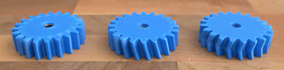

Dans le même ordre, on retrouve :

- **Denture droite** (EN - spur)

    Le plus économique et simple à fabriquer en industrie.
    Les contacts entre les dents se font via un choc, ce qui créer des vibrations, du bruit et diminue légèrement la durée de vie.

- **Denture hélicoïdale** (EN - helical)

    Le contact se fait progressivement, moins de bruit et de vibration. Par conséquent, meilleur rendement. Plus cher en industrie, et création d'effort axiaux.

- **Denture à double hélice** (EN - Herringbone)

    Semblable à la denture hélicoïdale, mais réduction des efforts axiaux, amélioration du rendement.
    Fabrication très difficile en industrie. 

Une denture plus complexe est généralement plus solide (moins de vibration, meilleur géométrie), et a un meilleur rendement. L'avantage est qu'en impression 3D, le temps d'impression reste quasiment constant.

En impression 3D, une denture droite peut avoir un meilleur rendement que les autres dentures, selon le matériau utilisé. En effet, c'est la denture avec la surface de contact la plus petite.

!!! example "Denture à fuseau"

    Les engrenages à fuseaux ont un pignon lanterne, et une deuxième roue appelé "rouet". Le rouet à des dents cylindre, qui engrènent avec des encoches à l'intérieur de la lanterne.

     

    > Il ne faut pas confondre les engrenages à denture intérieure avec les engrenages à fuseaux.

Résumé :

<table>
  <thead>
    <tr>
      <th>Type</th>
      <th>Avantages</th>
      <th>Inconvénients</th>
      <th>Usage courant</th>
    </tr>
  </thead>
  <tbody>
    <tr>
      <td>Denture droite</td>
      <td>Simple à fabriquer, économique</td>
      <td>Bruit, chocs, rendement moyen</td>
      <td>Transmissions simples</td>
    </tr>
    <tr>
      <td>Hélicoïdale</td>
      <td>Silencieuse, bon rendement</td>
      <td>Complexe, efforts axiaux</td>
      <td>Automobile, machines industrielles</td>
    </tr>
    <tr>
      <td>Double hélice</td>
      <td>Pas d'efforts axiaux, très bon rendement</td>
      <td>Très complexe</td>
      <td>Machines haute performance</td>
    </tr>
    <tr>
      <td>Denture intérieure</td>
      <td>Compacte, pas d'inversion de sens</td>
      <td>Moins rigide, maintien difficile</td>
      <td>Réducteurs compact</td>
    </tr>
    <tr>
      <td>Crémaillère</td>
      <td>Conversion rotation en translation</td>
      <td>Longueur limitée, fixation difficile</td>
      <td>Automobile, Portes</td>
    </tr>
    <tr>
      <td>Vis sans fin</td>
      <td>Fort ratio, autobloquant possible</td>
      <td>Faible rendement, usure rapide, peu inversible</td>
      <td>Réducteurs</td>
    </tr>
    <tr>
      <td>Engrenage conique</td>
      <td>Transmission angulaire</td>
      <td>Usinage complexe, alignement critique</td>
      <td>Transmission à angle droit</td>
    </tr>
  </tbody>
</table>

Par exemple, les boîtes de vitesses des voitures utilisent des engrenages à hélice simple ou double; mais la marche arrière utilise généralement un engrenage droit parallèle, ce qui explique le bruit caractéristique du véhicule en marche arrière.

#### Cas particulier

##### Train épicycloïdal

Le train épicycloïdal est un cas d'étude intéressant :

- L'axe de rotation en entrée et en sortie est le même.
- Facile à utiliser dans une structure en étage.

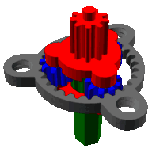

Il est composé des éléments :

- Satellite (bleu)
- Porte-satellite (rouge)
- Axe (vert)
- Couronne (gris)

Il y a 3 entrées (ou sortie) sur ce système.  
l'axe, le porte-satellite, la couronne.  
Il y a donc plusieurs utilisation possible :

- 1 entrée / 1 sortie
- 2 entrées / 1 sortie
- 1 entrée / 2 sorties

Ce qui permet donc d'additionner 2 vitesses, ou de diviser une vitesse en deux. Le fonctionnement est assez similaire à un différentiel de vitesse dans une voiture.

### Axes de rotation

### Notion d'adhérence

Lorsque l'on étudie les frottements en classe prépa, on utilise souvent la loi de Coulomb. Mais en réalité, cette hypothèse n'est pas toujours valide.

Il existe 2 facteurs important pour définir l'adhérence

- **Contact**

  Créé des frottements proportionnels au poids appliqué, dépend du type de matériau.

- **Rugosité**

  Augmente lorsque la surface de contact augmente.

Lorsque le contact s'effectue entre 2 surfaces lisse, on a une adhérence majoritairement par contact, et la loi de Coulomb s'applique.

Dans le cas d'une roue en contact avec une surface plate, voici ce qu'il faut prendre en compte :

- Il faut faire attention a ne pas choisir des roues trop épaisse, car la surface de la roue n'est pas parfaitement aligné avec l'horizontale, ce qui signifie qu'on ne sait pas ou se situe le centre d'adhérence de la roue, et peut fausser les calculs.
- Si il y a du poids sur la roue, il faut aussi faire attention à la pression exercé au niveau de centre de contact. Ce n'est normalement pas trop un problème en robotique, mais on sait jamais.

### Liaisons mécanique

#### Méthodes d'étude

##### Cinématique

La cinématique est l'étude du mouvement des solides. Elle permet de décrire la position, la vitesse et l'accélération des objets à chaque instant, sans considérer les forces ou les moments. Elle permet d'obtenir la trajectoire/position des pièces lors d'un mouvement.

##### Statique

La statique est l'étude des systèmes soumis à des forces, en l'absence d'accélération. Elle repose principalement sur le principe fondamental de la statique : la somme des forces et des moments exercés sur un système en équilibre est nulle. Elle permet de déterminer les efforts dans les liaisons, les dimensions minimales, etc...

##### Dynamique

La dynamique combine les notions de mouvement (cinématique) et les forces (statique) pour étudier le comportement des systèmes. Elle repose sur le principe fondamental de la dynamique (seconde loi de Newton / théorème du moment cinétique). Elle permet permet de prédire les accélérations, les réponses vibratoires, etc...

##### Énergétique

La méthode énergétique consiste à analyser les systèmes mécaniques à partir des grandeurs globales que sont le travail, la puissance et l'énergie (cinétique, potentielle, dissipée). Elle repose sur le théorème de l'énergie cinétique et le théorème de la puissance. Elle permet d'aborder des systèmes complexes sans passer systématiquement par l'analyse interne des forces.

#### Liaisons possibles (TODO)

Contenu adapté de la page Wikipédia :  
[Liaison mécanique — Wikipédia](https://fr.wikipedia.org/wiki/Liaison_(m%C3%A9canique)), section "Tableau des liaisons parfaites". (07/2025)

Il existe un nombre finit de liaison mécanique avec un sens physique. Voici une liste des différents types de liaison :

Colomne 1 | Colomne 2
:--------:|:---------:
 |Pinguoins : oui
 | 

##### Ponctuelle (contact sphère-plan)

Torseur cinématique :
$$
\begin{Bmatrix}
\omega_x & v_x \\
\omega_y & v_y \\
\omega_z & 0
\end{Bmatrix}_M
$$

Torseur des actions mécaniques :
$$
\begin{Bmatrix}
0 & 0 \\
0 & 0 \\
Z & 0
\end{Bmatrix}_M
$$

##### Rectiligne (contact cylindre-plan)

Torseur cinématique :
$$
\begin{Bmatrix}
\omega_x & v_x \\
0 & v_y \\
\omega_z & 0
\end{Bmatrix}_M
$$

Torseur des actions mécaniques :
$$
\begin{Bmatrix}
0 & 0 \\
0 & M \\
Z & 0
\end{Bmatrix}_M
$$

##### Annulaire (contact sphère-cylindre)
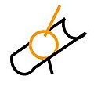

Torseur cinématique :
$$
\begin{Bmatrix}
\omega_x & v_x \\
\omega_y & 0 \\
\omega_z & 0
\end{Bmatrix}_C
$$

Torseur des actions mécaniques :
$$
\begin{Bmatrix}
0 & 0 \\
Y & 0 \\
Z & 0
\end{Bmatrix}_C
$$

##### Rotule (contact sphère-sphère)

Torseur cinématique :
$$
\begin{pmatrix}
\omega_x & 0 \\
\omega_y & 0 \\
\omega_z & 0
\end{pmatrix}_A
$$

Torseur des actions mécaniques :
$$
\begin{Bmatrix}
X & 0 \\
Y & 0 \\
Z & 0
\end{Bmatrix}_A
$$

##### Rotule à doigt (bloquée en z)

Torseur cinématique :
$$
\begin{Bmatrix}
\omega_x & 0 \\
\omega_y & 0 \\
0 & 0
\end{Bmatrix}_C
$$

Torseur des actions mécaniques :
$$
\begin{Bmatrix}
X & 0 \\
Y & 0 \\
Z & N
\end{Bmatrix}_C
$$

##### Pivot-glissant (contact cylindre-cylindre)

Torseur cinématique :
$$
\begin{Bmatrix}
\omega_x & v_x \\
0 & 0 \\
0 & 0
\end{Bmatrix}_M
$$

Torseur des actions mécaniques :
$$
\begin{Bmatrix}
0 & 0 \\
Y & M \\
Z & N
\end{Bmatrix}_M
$$

##### Pivot

Torseur cinématique :
$$
\begin{Bmatrix}
0 & 0 \\
0 & 0 \\
\omega_z & 0
\end{Bmatrix}_M
$$

Torseur des actions mécaniques :
$$
\begin{Bmatrix}
X & L \\
Y & M \\
Z & 0
\end{Bmatrix}_M
$$

##### Glissière

Torseur cinématique :
$$
\begin{Bmatrix}
0 & v_x \\
0 & 0 \\
0 & 0
\end{Bmatrix}_M
$$

Torseur des actions mécaniques :
$$
\begin{Bmatrix}
0 & L \\
Y & M \\
Z & N
\end{Bmatrix}_M
$$

##### Hélicoïdale

Torseur cinématique :
$$
\begin{Bmatrix}
\omega_x & p \cdot \omega_x \\
0 & 0 \\
0 & 0
\end{Bmatrix}_M
$$

Torseur des actions mécaniques :
$$
\begin{Bmatrix}
X & p \cdot X \\
Y & M \\
Z & N
\end{Bmatrix}_M
$$

##### Encastrement
Torseur cinématique :
$$
\begin{Bmatrix}
0 & 0 \\
0 & 0 \\
0 & 0
\end{Bmatrix}_M
$$

Torseur des actions mécaniques :
$$
\begin{Bmatrix}
X & L \\
Y & M \\
Z & N
\end{Bmatrix}_M
$$

#### Théorie des mécanismes
