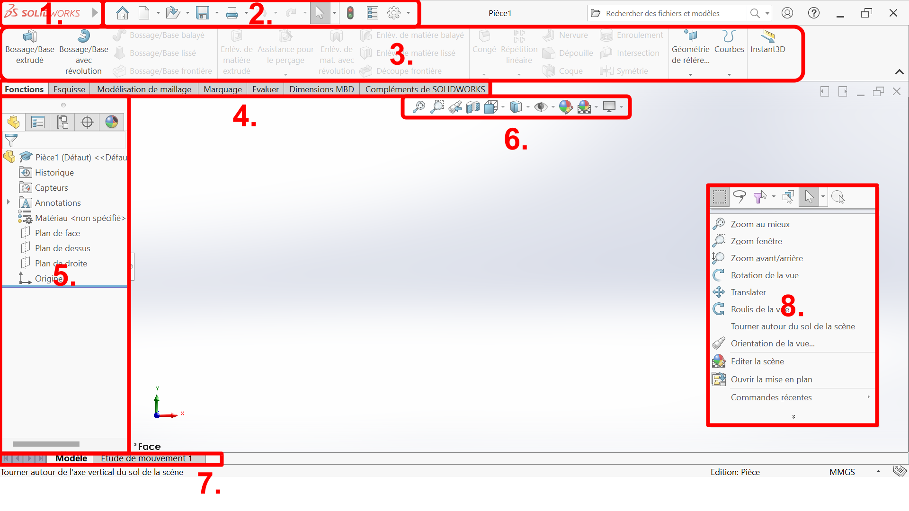
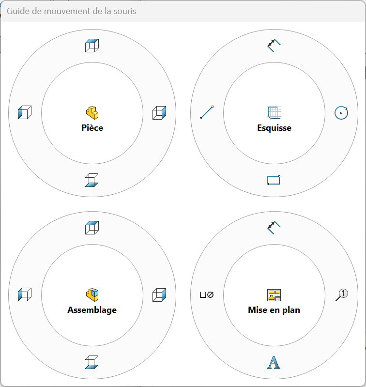
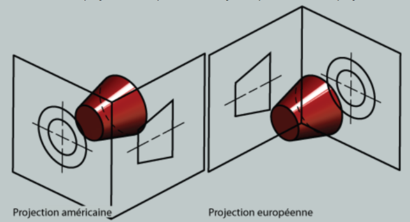

# SolidWorks
Ce document a été écrit en utilisant la version SolidWorks 2024.
## Installation

## Interface
À première vue, cette partie peut sembler inutile. Cependant, il y a **beaucoup** de menu et de barres dans SolidWorks. Et beaucoup d'entre elles sont imbriqués les unes dans les autres.

Lorsque l'on parcours un forum d'aide SolidWorks, il faut savoir où trouver les menus qui sont indiqué.
Voici le guide officiel solidworks. Il y a pleins de ressources utiles, mais il est difficile d'utilisation.  
[SolidWorks Web Help](https://help.solidworks.com/)  
La plupart des pages parlent de l'édition 2020 ou précédentes, cela peut parfois engendrer de la confusion.

Voici les noms important, qui peut être pertinent de connaître :

1. Barre de menus  (à survoler au curseur)
2. Barre d'outils accès rapide
3. Onglet / Barre d'outils
4. Barre de raccourcis
5. Volet de définition
6. Outils - Affichage (menu à "visée haute")
7. Outils - MotionManager
8. Menu contextuel

Il s'agit ici d'une configuration par défaut de SolidWorks 2024, mais il se peut que vous ayez tout de même une interface légèrement différente.

La plupart des menus SolidWorks sont customisable, ce qui veut dire qu'on peut choisir si ils sont actifs ou pas, et choisir les options présentes dans ces menus.

> Barre de menus > Outils > Personnaliser...  

 Cependant, la (1.) *Barre de menus* et la (2.) *Barre d'outils accès rapide* sont important et il est recommander de ne pas les modifier. Je recommande également de ne pas toucher aux onglets du (5.) *Volet de définition*

Sous SolidWorks, un outils (3. 6. 7.) est un ensemble de fonctions, regroupé sous une même catégorie.
Les outils peuvent avoir leur propre barre (6. 7.), où être incorporé dans la barre de raccourcis (3.).

La barre de raccourcis (4.) permet une customisation complète. Il est possible de créer ses propres onglets / barres d'outils, et de modifier les fonctions présentes sur chaque page.

Le menu contextuel (8.) s'affiche lors d'un clic droit de la souris. Il permet des réglages de caméra. Il est possible de faire un clic droit long pour afficher l'onglet mouvements de la souris. L'affichage de ce menu dépend du contexte dans lequel est le fichier ouvert. Voici les configurations par défaut possible :

Il peut y avoir des inconsistances sur le noms de certains menus, car certains ont changés de noms entre les forums (généralement édition 2020) et votre édition de SolidWorks. Les menus les plus important ont garder leur noms donc pas de panique.

## Configuration de base
### Contrôle du zoom
#### Explication
Il existe deux configurations possible lors de la projection des vues en dessin technique.

Le principe de la projection consiste à tracer un cube autour de la pièce et de projeter les vues sur chacunes des faces. Sur une mise en plan, on obtient l'image finale en "dépliant le cube".  
- **ASME (Convention américaine)**
    le plan de projection est entre l'objet et l'utilisateur.
- **ISO (Convention européenne)**
    l'objet est entre le plan de projection et l'utilisateur.  

La convention Européene a plus de sens lorsque l'on projette la pièce sur les faces du cube. On projette les faces sur le même côté que celle du cube.  
La convention Américaine est plus intuitive lorsqu'on lit un plan.  
Pour la convention américaine, il faut replier le cube et s'imaginer en train de le regarder devant soit. Pour la convention Européenne, il faut que l'observateur se place à l'intérieur de cube.  
Généralement pour la lecture d'un plan, il est plus simple de visualiser la pièce lorsque l'on est un observateur extérieur; mais ce n'est qu'une question d'habitude / de sens de lecture.

#### Réglage
Sur SolidWorks ce n'est pas génant, la seule différence sera lors de la création de mise en plan. Mais la direction du zoom avec la convention Européenne est inversée, et cela se reflète sur SolidWorks.
Pour changer ce paramètre dans SolidWorks :
> Barre d'outils accès rapide > Options (logo engrenage) > onglet Options du système > Vue > Cocher "Inverser la direction du zoom de la souris

### Thème couleur
Bien que l'implémentation ne soit pas super jolie, si vous souhaitez changer le thème couleur ("arrière plan") sur SolidWorks, vous pouvez aller dans :
> Barre d'outils accès rapide > Options (logo engrenage) > onglet Options du système > Couleurs

Ensuite vous avez un menu déroulant "*Arrière-plan*", où vous pouvez choisir "*Clair*", "*Moyennement éclairé*", "*Moyen*", "*Sombre*".  

Si vous scrollez un peu vous aurez aussi :
"*Apparence de l'arrière-plan*".  
Si vous souhaitez utiliser un thème autre que *clair*, vous ne pourrez pas utiliser l'arrière plan de la scène par défaut. Cependant, il est recommander de ne pas changer l'arrière plan de la scène car c'est parfois enregistré dans le fichier et ça peut être génant pour les autres.  
Je conseille donc de choisir une couleur unie (adapté pour faire des captures d'écrans) ou alors un dégradé. Vous pouvez aussi utiliser une image de fond customisé.