<div align="center">

# **Mécanique**

## *Restitution de connaissances*  

2024-2025  
Projet & Tech  

</div>

<div style="page-break-after: always;"></div>

# Introduction
## Présentation
Ce document a été originalement écrit suite à la participation à la coupe de France en 2025. J'encourage les prochaines promo à reprendre et à modifier ce document à leur guise.  
Auteur(s) : HUOT Thibault  
Les informations de contact des différents auteurs seront à mettre dans un document annexe.
## Objectifs du document
Ce document a pour but d'introduire un étudiant niveau ingénieur à la mécanique. L'objectif est aussi d'apprendre à faire de la mécanique orienté robotique dans le contexte d'un club de robotique. Il y a aussi des sections et exemples plus générales afin d'ouvrir sur d'autres possibilités et de développer la culture mécanique du lecteur.

# Projet&Tech
Considérations des aspects liés au travail en groupe, et à la présence de différents pôle.
## Communication
Même si le pôle mécanique est celui qui a le plus d'impact sur le design visuel du robot, la communication entre les différents pôles est très importante. 

Il faut absolument que la conception du robot prenne en-compte les contraintes éléctronique, lié au choix des actionneurs. Le choix des actionneurs à un impact significatif sur le nombre de pins utilisé, et donc sur l'architecture éléctronique du robot  
(nombre de carte, type de protocole de communication, architecture des cartes, modèle de micro-controlleur, etc...).

Le choix des actionneurs, et la faisabilité des actions a aussi un impact sur la partie informatique. Il faut limiter le nombre de motorisation différentes utilisé pour l'ensemble des actionneurs, et s'assurer que les mouvements de chaque actionneur soit cohérent. Avoir un actionneur qui demande trop d'attention ou de temporisation particulière est généralement un problème.

Le pôle mécanique ne doit donc pas décider des actionneurs tout seul, c'est une décision qui doit inclure l'avis de tout le monde.

Après chaque étape (modélisation d'un pièce, définition d'un cahier des charges), il faut faire valider la pièce par une personne investie dans le(s) pôle(s) concerné(s). De même, il faut faire les sessions de brainstorming avec le plus de personnes possible.

Il faut aussi récupérer du feedback, savoir si les pièces ont besoins d'être réajuster, même si elles fonctionnent quand même. Il peut aussi être intéressant d'avoir du feedback venant d'autres personnes du pôle mécanique, lors de la conception.

## Cahier des charges
La partie la plus difficile lorsque l'on débute, c'est de trouver et garder les solutions qui sont à la fois faisable, et fiable.
Il est difficile de définir une règle générale permettant de bien choisir une solution. Il faut réussir à se projeter, et faire un choix réflechi. Si le mécanisme est suffisament simple, il peut être intéressant de faire/modéliser un prototype rapide.

Parfois il n'y a pas besoin de modéliser de pièce, et un bricolage plus ou moins complexe peut être un bon compromis entre qualité et temps.

Après avoir choisi une solution, il faut définir des contraintes. Il est important d'effectuer ce travail avant de modéliser la pièce. En effet, cela permet de choisir quels paramètres seront fixé lors de la conception (même arbitrairement), et lesquels seront résolus/calculé automatiquement par le logiciel. C'est quelque chose qui permet de retoucher les pièces plus facilement et plus rapidement.

C'est un travail qui peut être plus difficile pour certaines personnes que pour d'autres, car cela peut faire appel à des compétences de visualisation mentale. Cependant, si on y consacre assez de temps, et qu'il y a suffisament de personnes, se n'est généralement pas un problème.

Lorsque l'on imagine une pièce, il faut prendre en compte le matériel présent à Projet&Tech. Le choix des vis et des actionneurs est important. Il peut être difficile de choisir un actionneur à la volée. Il faut avoir une idée de la visserie disponible, et prévoir si il faut en racheter.

Généralement, pour les actionneurs regarder la tension, et le couple maximum (et donc avoir une idée de la consommation éléctrique) suffit à faire un choix optimisé.
Pour un servomoteur, il faut aussi regarder l'amplitude de mouvement possible et l'amplitude de mesure possible.  (Par exemple, sur un potentiomètre, il n'y a pas forcément de bloquage mécanique, mais on ne dépasse généralement pas 300° d'amplitude éléctronique)

Lorsque l'on modélise une pièce, il faut aussi choisir un matériau et une méthode de fabrication. Si c'est de l'impression 3D, ça sera probablement du PLA, mais si on veut du bois ou du métal, il faudra le prendre en compte. Les matériaux ont différentes caractéristiques : Densité, Rigidité, Solidité à différents efforts, Coefficient de frottement, plasticité, etc...  Ils sont usiné par des machines différentes, et donc il y des contraintes d'assemblage et d'usinage différentes.  
Comparatif de différents matériau:  \[[matériau](#matériau)\] 

Il faut aussi prendre en compte l'importance et la taille de la pièce. Une pièce trop grande ne pourra pas forcément être usiné en 1 morceau. Cela peut aussi avoir un impact sur le choix de la machine utilisé pour l'usinage. De plus, une pièce importante doit probablement être fiable et résister à l'usure. Sinon il faut en faire plus, ce qui peut être un problème de temps et/ou d'argent.

## Gestion des tâches
Il faut faire très attention à toutes les idées qui peuvent passer par le pôle méca. Il faut noter chaque choses qui semble importante, ou qui est à faire.

Généralement, l'impression des pièces en 3D se fait par groupe de pièce, ce qui fait que vous pouvez être ammené à recevoir beaucoup de feedback par moments.

Cette tâche est importante car permet de voir la quantité de travail à réaliser avant de pouvoir passer à autre chose. De façon générale, voir les avancements et le travail effectué sur le robot permet aussi de se motivé, et de motiver le reste du groupe.

Le strict minimum est d'avoir une checklist avec indententation si-possible, pour catégoriser les tâches/pièces, et garder une trace du travail effectué / à effectué.

Il est aussi important de mettre en place un système de versionnage des pièces. Que ce soit localement en gardant un historique des pièces, ou sur un drive/git.

Pour donner un ordre de grandeur, (en 2024-25) il y a 72 pièces et 17 assemblages qui ont été modéliser pour le PAMI. La version finale n'utilise que 7 pièces et 1 assemblage.

# Introduction à la mécanique
## Vocabulaire
## Connaissances générales
### Norme ISO
La norme ISO est un ensemble de standards techniques publiés par l’Organisation internationale de normalisation (ISO – International Organization for Standardization), une organisation non gouvernementale fondée en 1947, basée à Genève.

En Europe, la norme ISO domine. Il est donc conseiller de se baser dessus à Projet&Tech. Il est possible d'utiliser différentes normes pour les différents domaines éléctronique/mécanique, et ce n'est pas forcément bloquant.

### Visserie
Il y a beaucoup de choses à dire sur les vis. En effet, il existe des livres de plusieurs centaines de pages, et de plusieurs volumes parlant des vis et de leur dimmensionnement. Cette section aborde les notions fondamentales.
#### Vocabulaire
Tout d'abord, il est important de différencier les différents éléments associé à la visserie :
- **Vis** (EN - screw)  
- **Écrou** (EN - nut)  
- **Boulon** (EN - bolt)  
    Ensemble vis + écrou

Il existe différents type d'écrou :
- **Écrou "classique"**  
    Écrou utilisé par défaut, permettant d'assembler deux pièces ensemble  
    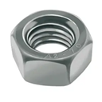  
- **Écrou de bloquage**  
    (ou écrou autobloquant) Écrou utilisé pour tenir des axes en rotation, ou résister au vibration. (Pensez-y c'est important)  
    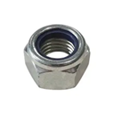  
    Cet écrou a une bague de serrage (généralement en plastique bleu, parfois gris), ce qui le rend difficile à visser/dévisser. Il ne peut normalement pas se dévisser sans intervention.
- **Écrou papillon**  
    (ou écrou à ailette)
    Écrou classique, mais avec des surfaces/poignées permettant un serrage à la main. Utile pour les éléments devant être monter/démonter fréquement ou rapidement.  
    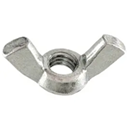  
    (à noter: il est obligatoire d'en utiliser pour stabiliser le mat de balise à la Coupe (2025))

Et différents type de vis :
- **Vis d'assemblage**  
    Vis classique avec une partie fileté/taraudé, nécéssitant un écrou pour être maintenu en place.
- **Vis de fixation**  
    Vis ne nécessitant pas d'écrou. Peut généralement être directement vissé dans un matériau.
    Un exemple répandu est les vis à bois.

Il existe d'autres type de vis spécifiques à des applications bien particulière, comme les vis auto-taraudeuse, auto-foreuse, à molette, etc... Normalement, elles ne sont pas utilisées en robotique.

#### Tête de vis  
Il y a 2 choses qui vont caractériser les différentes têtes de vis. La forme de la tête, et la forme de l'encoche.

**Le type de tête de vis :**  
  

dans l'ordre :
- Fraisé
- Ronde
- Cylindrique
- Plate

Il existe aussi des vis sans encoche, le contour extérieur - généralement héxagonal - permet alors le serrage. On les appelle vis à entraînement externe.  
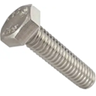  
Vue d'une vis à tête hexagonale "vis hexagonale", à entraînement externe.

**La forme de l'encoche :**
- Fendue
- Cruciforme (ou Philips)
- Hexagonale creux (ou Allen)
- Étoilée (ou Torx)

Il existe beaucoup de type et de forme de tête de vis. Ceux non présenté s'apparente à une catégorie déjà existante, ou sont rares.

 note : les vis à tête hexagonale (vis "type hexagonale") ne sont pas la même chose que les vis à encoche/empreinte hexagonale (vis "hexagonale creux")

#### Convention de nommage
La convention la plus répandue pour le nommage des vis est la norme ISO. Les vis ont alors la désignation suivante :  
```[Système d'unité][Diamètre]x[Longueur]x[Pas]```

**Exemple :** M3x20x0.5  
    M : métrique ou ISO métrique (à ne pas confondre avec isométrique).  
    La tige de la vis fait 3mm de diamètre et 20mm de long.   Chaque taille de vis (selon le diamètre) a une longueur de pas différent fixé par la norme ISO. Si la norme n'est pas utilisé, la longueur du pas est indiqué. Si le pas correspond à la norme, il n'est pas obligatoire de l'indiquer. Ici 0.5mm correspond à la norme, il est facultatif.

#### Taraudage
Le taraudage ou filetage est l'opération qui consiste à usiner un filet hélicoïdal dans un trou.
L'opération s'effectue à l'aide de tarauds, et on obtient un trou taraudé.
Il existe 2 variantes de taraudage : par déformation, et par enlèvement de copeaux.
Pour un matériau dur, on effectue généralement un taraudage par enlèvement de copeaux. On utilise 3 tarauds différents, avec différentes profondeurs de filet, et on met une goutte de lubrifiant.
Pour un matériau mou, un taraudage par déformation est recommandé, car plus lisse et résistant.
Il existe des couples recommandés pour effectuer un taraudage, selon des tailles de trous différents.

Par convention, un filetage est toujours droit; c'est à dire qu'on serre en tournant dans le sens horaire. Les filetages gauches sont très rares, et donc toujours indiqué.

### Engrenages
Il y a encore plus de choses à dire sur les engrenages que sur les vis. Cette section abordera les bases et principes des engrenages, en donnant une explication du vocabulaire spécifique à leur conception.  
Le but de cette section est de présenter les considérations pratique avant la modélisation et/ou l'assemblage d'un engrenage, et d'avoir une idée de comment les dimensionner. Elle doit aussi permettre d'introduire le vocabulaire afin de faciliter la compréhension des tutoriels en ligne.
#### Vocabulaire
Un engrenage est avant tout un système de transfert de mouvement et/ou de puissance. Ils sont très utilisés car constituent une solution solide.
Il existe aussi des normes pour les dimensions d'engrenage (norme ISO par exemple), ce qui permet de réduire les coûts dans l'industrie.

**Notations**  
$d$ : diamètre  
$r$ : rayon  

$\omega$ : vitesse en $rad.s^{-1}$  
$N$ : vitesse en $tr.min^{-1}$  

$M$ : couple (EN - Torque) en $kg.m$

$Z$ : nombre de dent
    
##### Généralités
- **Engrenage**  
    Ensemble de deux roues dentées engrenant l'une avec l'autre et permettant de transmettre une vitesse ou une puissance avec un rapport fixe.
    Il est intéressant de noter qu'une roue - dentée - et qu'un engrenage ne sont pas la même chose.
    En fonction du sens du montage, on parlera de roue menante (entrée) et de roue menée (sortie).

    Engrenage droit 
    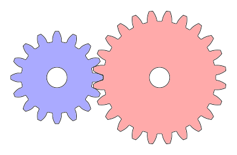  

- **Pignon**  
    Roue avec le plus petit nombre de dent. Dans le contexte d'un engrenage, ou d'un train d'engrenage.

- **Crémaillère**  
    Barre dentée, qui est équivalent à une roue de rayon infinie, et avec une infinité de dent. Dans le contexte d'un engrenage, la deuxième roue est donc le pignon.

    Pignon-Crémaillère  
    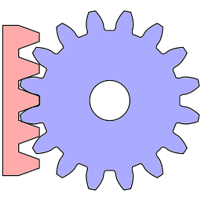  

- **Couronne**  
    Roue avec denture intérieure.

    Si la couronne est mobile, cela permet de ne pas inverser le sens de rotation lors de la transmission. Cependant, le maintien en place de la couronne extérieure est alors difficile.  
    
    La couronne peut être fixe dans certains cas, comme dans un [train épicycloïdal](#dentures).

    Pignon-Couronne
    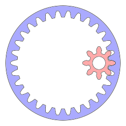  

- **Train d'engrenages**  
    Une combinaison d'engrenage.
    Donne naissance au vocabulaire "Train à étage", "Train épicycloïdale", etc...

##### Axes / Directions
- **Axiale** :
    direction parallèle à l'axe de rotation de la roue  
- **Radiale** :
    direction permettant de définir le tracé du rayon.  
- **Tangentiel** :
    tangent au tracé de la roue dentée, orthogonal à la direction radiale.


##### Point de contact
Avant de passer à la suite, il est important de comprendre comment se déplace le point de contact sur une roue dentée.  
  
Dans le cas d'un engrenage parallèle à denture droite, le point de contact se déplace selon une droite. C'est dans ce cas présent que le vocabulaire suivant est le mieux défini.
- **Droite de pression**  
    Segment / Droite où évolue le point de contact de l'engrenage.  
    cf. \[[géométrie](#géométrie)\]
- **Point d'engrènement**  
    Il y a 2 façon équivalente de le définir, ce qui change l'interprétation des prochaines définition.  
    -**i**- Centre du segment associé à la droite de pression.  
    -**ii**- Point de croisement entre la droite de pression, et la droite reliant les deux centres d'un engrenage.

    Lorsque le point de contact est proche du point d'engrènement, il n'y a pas de glissement entre les dents. Plus on s'en éloigne, plus il y a de glissement.
- **Angle de pression**  
    Cet angle sera noté $\alpha$.
    Il y a aussi 2 interprétations équivalentes possible  
    -**i**-  Angle de la droite de pression par rapport au plan tangent.  
    -**ii**- Angle de la dent au niveau du point d'engrènement, par rapport au plan radial.  
    
    C'est quelque chose qui est standardisé. Aujourd'hui il est de 20°, contre 14.5° avant.  
    Plus l'angle est petit, moins il y a d'effort radial. Le rendement est donc meilleur en théorie. La durée de vie de l'axe est meilleure.  
    Cependant, l'angle a été augmenter à 20° car l'effort radial reste gérable. Et, un engrenage à moins de chances de sauter une dent, ce qui est un phénomène assez grave, car endommage le mécanisme.
    Un angle de pression de 20° permet aussi d'avoir des dents avec des formes plus triangulaires (moins rectangulaire que 14.5°), ce qui augmente la résistance générale d'un engrenage.  
- **Contact Ratio**  
    Souvent noté $\epsilon$.
    C'est le rapport entre la distance entre 2 dents, mesuré sur le cercle de base et la longueur de la droite de pression.  
    Il correspond au nombre de dents moyen qui se touchent en même temps lors de la rotation.  
    Il faut $\epsilon > 1$ pour garantir qu'au moins une dents soit toujours en contact.   
    $$\epsilon = \frac {
        \sqrt{r^2_{1_\text{tête}}-r^2_{1_\text{base}}}
        +\sqrt{r^2_{2_\text{tête}}-r^2_{2_\text{base}}}
        -\sqrt{
            (r_{1_\text{primitif}} + r_{2_\text{primitif}})^2
            -(r_{1_\text{base}} + r_{2_\text{base}})^2}}
    {p * cos(\alpha)}$$  
    Vocabulaire associé à la définition :  \[[variables](#variables)\] 
##### Surfaces
Vocabulaire important :
- **Cercle primitif** (EN - pitch circle)  
    Le cercle primitif a le même centre que l'engrenage auquel il est associé. (relation concentrique)
    Il doit passer par le point d'engrènement.
- **Cercle de base** (EN - base circle)  
    Concentrique avec la roue.
    Le cercle est tangent avec la droite de pression.
    $d_\text{base} = d_\text{primitif} * cos(\alpha)$
- **Cercle de pied** (EN - dedendum circle)  
    Cercle associé au diamètre minimum de la roue dentée.  
- **Cercle de tête** (EN - addendum circle)  
    Cercle associé au diamètre maximum de la roue dentée.
- **Cercle de dégagement** (EN - clearance circle)  
    Cercle définit dans la convention AGMA. Il permet de faire la différence entre le cercle de pied avec et sans jeu.  
    Pour mieux comprendre : \[[hauteur des dents](#hauteur-des-dents)\] 

- **Saillie**  
    Distance entre le cercle primitif et le cercle de tête.
- **Creux**  
    Distance entre le cercle primitif et le cercle de pied.

Vocabulaire peu important :
- **Tête**  
    Partie de la dent comprise entre le cercle de tête, et le cercle primitif.
- **Pied**  
    Partie de la dent comprise entre le cercle de pied, et le cercle primitif.
- **Flanc**  
    Flanc : Surface correspondant au côté de la dent.
    On définira aussi le "flanc de saillie" et le "flanc de creux".
    Le flanc de saillie est forcément convexe.
- **Fond**  
    Surface associé à la distance entre le pied de 2 dents.
- **Sommet**  
    Surface associé au dessus de la tête d'une dent.
- **Largeur de la denture**  
    Épaisseur de la roue dentée/ de la roue, selon la direction axiale.
- **Épaisseur**  
    Longueur d'arc associé à la largeur d'une dent, selon la direction tangente. Mesuré sur le cercle de base.
- **Intervalle**  
    Longueur d'arc associé associé à l'écart entre deux dent, selon la direction tangente. Mesuré sur le cercle de base.
- **Entraxe**  
    Distance "entre les axes" des deux roues d'un même engrenage.
##### Variables
- **Pas** (EN - circular pitch)
    Pas primitif : distance d'arc séparant deux centres de dent. Mesuré sur le cercle primitif, noté $p$.  
    $p = \frac{\pi \cdot d_\text{base}}{Z}$  
    C'est aussi la somme de l'épaisseur et de l'intervalle.

    Pour obtenir une roue dentée "normale", il faut que le pas soit un diviseur du périmètre du cercle; afin d'obtenir un nombre de dents entier.
- **Module**  
    $m = \frac{p}{\pi}$ (en mm)  
    Il y a des valeurs de module normalisés.  

    Généralement, lorsque l'on dimensionne un système, on préfère fixer le module plutôt que le pas, qu'un nombre de dent ou qu'un diamètre, car le module est directement utilisé dans le dimensionnement des dents d'engrenage.

    La division par $\pi$ a aussi l'avantage de simplifier les notations. En effet, la formule du périmètre d'un cercle : $P = 2*\pi * r$ fait intervenir pi. Lorsque l'on fixe $m = 1$, alors le pas est $p = \pi$.  

    L'avantage est qu'il est plus facile de vérifier que le module est un diviseur du diamètre, car c'est un nombre rationnel.

    Comme le module sert uniquement à faire du dimensionnement, on le définit toujours avec un pas en millimètres.

    Il est aussi possible de l'estimer avec la formule suivante :
    $$m = 2.34 \cdot \sqrt{\frac{F_T}{k \cdot R_\text{pe}}}$$
    où $F_T$ est l'effort tangentiel, $k$ est le coefficient de largeur de la denture, $R_\text{pe}$ la résistance pratique à l'extension du matériau

- **Diametral Pitch**  
    Les américains utilisent les pouces pour dimensioner leur système. Et, ils utilisent encore des anciennes notions tel que le *Diametral Pitch*.  
    On peut le définir tel que :  
    $d_p = \frac{\pi}{p}$ (en pouces)  
    $d_p = \frac{25.4}{m.\pi}$  
    Comme pour le module, le *Diametral Pitch* n'est définit que pour des valeurs de p en pouces.

- **Rapport de Réduction**  
    Les rapports de réductions sont notés de la façon suivante : 
    $$Z_\text{mené} : Z_\text{menant}$$
    On préfère généralement écrire le quotient de façon explicite plutôt que de le calculer ou de le simplifier.  
    Parfois, on les notes aussi avec des vitesses, mais c'est moins courant.

#### Condition d'engrènement :
Il faut que le ratio "diamètre / nombre de dent" des deux roues soit égale. C'est équivalent à avoir une relation d'égalité sur le pas ou le module.

Pour deux roues en contact sans glissement, on a :  
$$\frac{\omega_2}{\omega_1}=\frac{r_1}{r_2}=\frac{Z_1}{Z_2}=\frac{M_1}{M_2}$$

Pour la suite, on se limitera au cas le plus simple, pour un engrenage de type parallèle, à denture droite.

Un problème que l'on rencontre souvent sur les engrenages est qu'il y a des défauts sur les dents des roues. C'est quelque chose à prendre en compte lorsque l'on choisit le nombre de dent de chaque roue dentée.  
En effet, pour augmenter la longévité du système, on peut faire en sorte que les dommages liées au défauts soient répartit sur le plus grand nombre de dents possible. Pour cela, on choisit des nombres de dents qui n'ont pas de diviseurs commun.  
Par exemple, si on a un engrenage 12:24, on a un diviseur commun de 2; donc à chaque tour, les mêmes dents de la roue 1 entrent en contact avec les mêmes dents de la roue 2.
Un engrenage 12:25 ou 12:23 serait beaucoup plus pertinent.

#### Géométrie
Problématiques : Comment définir le profil d'une dent d'engrenage ? Comment introduire du jeu afin de ne pas être sur-contraint ?
##### Hauteur des dents
Pour que les dents engrènent bien, il faut que la géométrie du creux soit adapté. En effet, on ne veut pas que les dents de la roue 1 frottent sur le creux d'une roue 2. On introduit donc un jeu sur la hauteur de creux.

Généralement on fixe (norme ISO) :  
$$h_\text{saillie} = m$$
$$h_\text{creux} = m * 1.25$$
$$h_\text{dégagement} = h_\text{creux}$$

Sinon on fixe (norme AGMA) :  
$$h_\text{saillie} = m$$
$$h_\text{creux} = m$$
$$h_\text{dégagement} = m+c$$
$$c = 0.167$$

Ces distances sont définies par rapport au cercle primitif.  
Ces définitions sont en réalité équivalente, mais proviennent de deux point de vue différents. La norme ISO inclus le jeu dans la définition du cercle de pied. La norme AGMA ne le fait pas, car elle considèrent que c'est une valeur libre de choix; même si typiquement fixée à c = 0.167. La terminologie diffère aussi légèrement.  
En prenant un diamètre minimum $1.25 \cdot m$ ou  $1.167 \cdot m$, les définitions se croisent.

##### Profil des dents
La forme du profil d’une dent d’engrenage parallèle à denture droite, est une courbe involute, aussi appelée dans le contexte des engrenages développante de cercle. (courbe à développante de cercle = les normales sont tangentes au cercle).  
Il y a deux approches possible, la première étant plus ressemblante aux calculs effectués.  
-**i**-  On peut la visualiser comme la trajectoire suivie par un point situé à l’extrémité d’un fil tendu que l’on déroule le long du cercle de base, sans glisser.  
-**ii**- C’est la courbe que tracerait un point sur le bord d’une roue lorsqu’elle roule sans glisser sur une ligne droite.   
Cette forme particulière permet que le point de contact se déplace linéairement (suivant une droite), et donc d'éviter des chocs liés aux changements d'accélérations. La transmission est alors théoriquement parfaitement fluide. De plus, elle garantit un rapport de transmission constant, indépendant de l’angle d’engrènement entre les dents 
(parallèle à la section [point de contact](#point-de-contact))

$$x(t) = (d_\text{base} / 2) * (cos(t) + t(sin(t)))$$
$$y(t) = (d_\text{base} / 2) * (sin(t) - t(cos(t)))$$

Les termes $cos(t)$, $sin(t)$ correspondent à la position sur le cercle de base. Les termes $t \cdot sin(t)$, $t \cdot cos(t)$ correspondent au "déroulement du fil" / à la courbe involute.
Cette équation correspond à la courbe involute du cercle de base, dont l'origine (t=0) - c'est à dire le point de rebroussement - se situe sur le cercle de base.

Cette équation permet de définir la forme du contour du haut de la dent. En effet, elle n'est utile que pour la section allant du cercle de base jusqu'au cercle de tête.  
Pour la section allant du cercle de pied jusqu'au cercle de base, si il y a suffisament de dents ($Z$ > $Z_\text{min}$), alors on prolonge la courbe involue. Sinon, ($Z$ < $Z_\text{min}$), alors on amincit le pied de la dent. Amincir la dent a deux conséquence : 
  - le pied de la dent est fragilisé
  - peut créer un point de contact prolongé
 
On parle surplomb (FR) ou d'undercut (EN)

Exemple (avec la roue rouge surplombée)
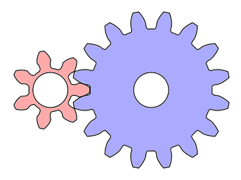

Il se pose aussi la question de comment introduire un jeu. Un effet, un tel assemblage est sur-contraint/hyperstatique.  
Typiquement, on commence par calculer/fixer la distance entre-axe de jeu maximale. Ce qui nous permet ensuite de calculer $Z_\text{min}$  
Voir [annexe](#cours-engrenage) (Involute Gears 3: Contact Ratio).

Pour une crémaillère, qui peut être vue comme un engrenage de rayon infini, la courbe involute se transforme en une droite (zoom infini). Cette droite est incliné selon l'angle de pression, mesuré par rapport à une direction radiale, passant par le point de rebroussement. Les dents sont donc triangulaire.

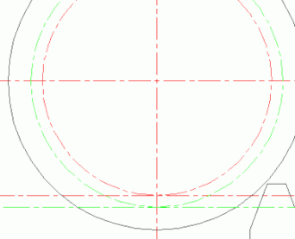 

Cette propriété permet une manière peu coûteuse de fabriquer des roues dentées, grâce à l'utilisation de crémaillères. Pour un outil, on doit définir le module $m$ et l'angle de pression $\alpha$. Si on fixe $\alpha = 20°$, et qu'on choisit un module parmis les modules normalisés, alors le nombre d'outil nécessaire pour couvrir une norme est raisonnable.

##### Résumé
Le profil des dents d’un engrenage droit est une courbe involute, tracée à partir du cercle de base. Cette forme garantit un rapport de vitesse constant, avec un point de contact qui se déplace de façon linéaire, assurant un engrènement sans chocs ni vibrations.

Pour garantir un fonctionnement fiable, deux types de jeux sont introduits :

- **Le jeu entre-axe** qui correspond à la tolérance sur la distance entre les centres des roues, évitant un contact excessivement serré.

- **Le jeu de pied**, qui laisse un espace au niveau des creux pour empêcher les dents d’une roue 1 de frotter sur la base des dents d'une roue 2.

Ces jeux sont essentiels pour assurer un engrènement durable.

#### Types de transmission
Il y a 3 grosse catégorie d'engrenage :
- **Engrenages parallèles** (à axe parallèle)  
    ex : engrenage à denture droite
- **Engrenages concourants** (les axes de rotation se croisent)  
    ex : engrenage conique
    Généralement utilisé pour des liaisons à 90°, mais existe pour tout angle.
- **Engrenages gauches** (axes dans des plans distincts)  
    ex : roue et vis sans fin

    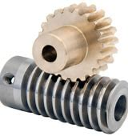 

    note : un ensemble "roue et vis sans fin" / "engrenage à vis" (FR) ou "wormgear" (EN) ne peut transmettre de la puissance que dans le sens $\text{vis} \rArr \text{roue}$. Il est très difficile de transmettre la puissance dans le sens $\text{roue} \rArr \text{vis}$. Cependant, il existe des système avec des billes pour réduire les frottements, et le rendre inversible.

Comme la crémaillère est considéré comme une roue de rayon infinie, une liaison pignon-crémaillère classique correspond à une liaison en parallèle.  
Il existe des cas particuliers car ils correspondent à aucune ou à plusieurs catégories. (ex: hypoïde)
#### Dentures
Les dentures fonctionnent avec les 3 catégories d'engrenages. Les plus simples sont généralement utilisé dans des liaisons non-droites, plus complexes à fabriquer.

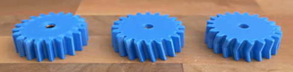

Dans le même ordre, on retrouve :
- **Denture droite** (EN - spur)  
    Le plus économique et simple à fabriquer en industrie.
    Les contacts entre les dents se font via un choc, ce qui créer des vibrations, du bruit et diminue légèrement la durée de vie.

- **Denture hélicoïdale** (EN - helical)  
    Le contact se fait progressivement, moins de bruit et de vibration. Par conséquent, meilleur rendement. Plus cher en industrie, et création d'effort axiaux.
- **Denture à double hélice** (EN - Herringbone)  
    Semblable à la denture hélicoïdale, mais réduction des efforts axiaux, amélioration du rendement.
    Fabrication très difficile en industrie. 

Une denture plus complexe est généralement plus solide (moins de vibration, meilleur géométrie), et a un meilleur rendement. L'avantage est qu'en impression 3D, le temps d'impression reste quasiment constant.  

En impression 3D, une denture droite peut avoir un meilleur rendement que les autres dentures, selon le matériau utilisé. En effet, c'est la denture avec la surface de contact la plus petite.


Autres cas spécifiques
- **Denture à fuseau**  
    Les engrenages à fuseaux ont un pignon lanterne, et une deuxième roue appelé "rouet". Le rouet à des dents cylindre, qui engrènent avec des encoches à l'intérieur de la lanterne.

     

Il ne faut pas confondre les engrenages à denture intérieur avec les engrenages à fuseaux.

Résumé :
<table>
  <thead>
    <tr>
      <th>Type</th>
      <th>Avantages</th>
      <th>Inconvénients</th>
      <th>Usage courant</th>
    </tr>
  </thead>
  <tbody>
    <tr>
      <td>Denture droite</td>
      <td>Simple à fabriquer, économique</td>
      <td>Bruit, chocs, rendement moyen</td>
      <td>Transmissions simples</td>
    </tr>
    <tr>
      <td>Hélicoïdale</td>
      <td>Silencieuse, bon rendement</td>
      <td>Complexe, efforts axiaux</td>
      <td>Automobile, machines industrielles</td>
    </tr>
    <tr>
      <td>Double hélice</td>
      <td>Pas d'efforts axiaux, très bon rendement</td>
      <td>Très complexe</td>
      <td>Machines haute performance</td>
    </tr>
    <tr>
      <td>Denture intérieure</td>
      <td>Compacte, pas d'inversion de sens</td>
      <td>Moins rigide, maintien difficile</td>
      <td>Réducteurs compact</td>
    </tr>
    <tr>
      <td>Crémaillère</td>
      <td>Conversion rotation en translation</td>
      <td>Longueur limitée, fixation difficile</td>
      <td>Automobile, Portes</td>
    </tr>
    <tr>
      <td>Vis sans fin</td>
      <td>Fort ratio, autobloquant possible</td>
      <td>Faible rendement, usure rapide, peu inversible</td>
      <td>Réducteurs</td>
    </tr>
    <tr>
      <td>Engrenage conique</td>
      <td>Transmission angulaire</td>
      <td>Usinage complexe, alignement critique</td>
      <td>Transmission à angle droit</td>
    </tr>
  </tbody>
</table>

Par exemple, les boîtes de vitesses des voitures utilisent des engrenages à hélice simple ou double; mais la marche arrière utilise généralement un engrenage droit parallèle, ce qui explique le bruit caractéristique du véhicule en marche arrière.

#### Cas particulier
##### Train épicycloïdal
Le train épicycloïdal est un cas d'étude intéressant:
- L'axe de rotation en entrée et en sortie est le même.
- Facile à utiliser dans une structure en étage.

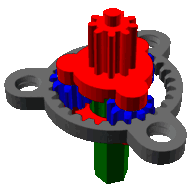

Il est composé des éléments:
- Satellite (bleu)
- Porte-satellite (rouge)
- Axe (vert)
- Couronne (gris)

Il y a 3 entrées (ou sortie) sur ce système.
l'axe, le porte-satellite, la couronne.
Il y a donc plusieurs utilisation possible:  
1 entrée / 1 sortie  
2 entrées / 1 sortie  
1 entrée / 2 sorties  

Ce qui permet donc d'additionner 2 vitesses, ou de diviser une vitesse en deux. Le fonctionnement est assez similaire à un différentiel de vitesse dans une voiture.

### Axes de rotation

### Notion d'adhérence
Lorsque l'on étudie les frottements en classe prépa, on utilise souvent la loi de Coulomb. Mais en réalité, cette hypothèse n'est pas toujours valide.

Il existe 2 facteurs imporant pour définir l'adhérence
- **Contact**  
Créé des frottements proportionnels au poids appliqué, dépend du type de matériau.
- **Rugosité**  
Augmente lorsque la surface de contact augmente.

Lorsque le contact s'effectue entre 2 surfaces lisse, on a une adhérence majoritairement par contact, et la loi de Coulomb s'applique.

Dans le cas d'une roue en contact avec une surface plate, voici ce qu'il faut prendre en compte :
- Il faut faire attention a ne pas choisir des roues trop épaisse, car la surface de la roue n'est pas parfaitement aligné avec l'horizontale, ce qui signifie qu'on ne sait pas ou se situe le centre d'adhérence de la roue, et peut fausser les calculs.
- Si il y a du poids sur la roue, il faut aussi faire attention à la pression exercé au niveau de centre de contact. Ce n'est normalement pas trop un problème en robotique, mais on sait jamais.

### Liaisons mécanique
#### Méthodes d'étude
##### Cinématique

La cinématique est l’étude du mouvement des solides. Elle permet de décrire la position, la vitesse et l’accélération des objets à chaque instant, sans considérer les forces ou les moments. Elle permet d'obtenir la trajectoire/position des pièces lors d'un mouvement.

##### Statique

La statique est l'étude des systèmes soumis à des forces, en l'absence d'accélération. Elle repose principalement sur le principe fondamental de la statique : la somme des forces et des moments exercés sur un système en équilibre est nulle. Elle permet de déterminer les efforts dans les liaisons, les dimensions minimales, etc...

##### Dynamique

La dynamique combine les notions de mouvement (cinématique) et les forces (statique) pour étudier le comportement des systèmes. Elle repose sur le principe fondamental de la dynamique (seconde loi de Newton / théorème du moment cinétique). Elle permet permet de prédire les accélérations, les réponses vibratoires, etc...

##### Énergétique

La méthode énergétique consiste à analyser les systèmes mécaniques à partir des grandeurs globales que sont le travail, la puissance et l’énergie (cinétique, potentielle, dissipée). Elle repose sur le théorème de l’énergie cinétique et le théorème de la puissance. Elle permet d’aborder des systèmes complexes sans passer systématiquement par l’analyse interne des forces.


#### Liaisons possibles
Contenu adapté de la page Wikipédia :  
[Liaison mécanique — Wikipédia](https://fr.wikipedia.org/wiki/Liaison_(m%C3%A9canique)), section "Tableau des liaisons parfaites". (07/2025)

Il existe un nombre finit de liaison mécanique avec un sens physique. Voici une liste des différents types de liaison :

Colomne 1 | Colomne 2
:--------:|:---------:
 |Pinguoins : oui
 | 


##### Ponctuelle (contact sphère-plan)


Torseur cinématique :
$$
\begin{Bmatrix}
\omega_x & v_x \\
\omega_y & v_y \\
\omega_z & 0
\end{Bmatrix}_M
$$

Torseur des actions mécaniques :
$$
\begin{Bmatrix}
0 & 0 \\
0 & 0 \\
Z & 0
\end{Bmatrix}_M
$$

##### Rectiligne (contact cylindre-plan)
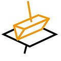

Torseur cinématique :
$$
\begin{Bmatrix}
\omega_x & v_x \\
0 & v_y \\
\omega_z & 0
\end{Bmatrix}_M
$$

Torseur des actions mécaniques :
$$
\begin{Bmatrix}
0 & 0 \\
0 & M \\
Z & 0
\end{Bmatrix}_M
$$

##### Annulaire (contact sphère-cylindre)


Torseur cinématique :
$$
\begin{Bmatrix}
\omega_x & v_x \\
\omega_y & 0 \\
\omega_z & 0
\end{Bmatrix}_C
$$

Torseur des actions mécaniques :
$$
\begin{Bmatrix}
0 & 0 \\
Y & 0 \\
Z & 0
\end{Bmatrix}_C
$$

##### Rotule (contact sphère-sphère)


Torseur cinématique :
$$
\begin{Bmatrix}
\omega_x & 0 \\
\omega_y & 0 \\
\omega_z & 0
\end{Bmatrix}_A
$$

Torseur des actions mécaniques :
$$
\begin{Bmatrix}
X & 0 \\
Y & 0 \\
Z & 0
\end{Bmatrix}_A
$$

##### Rotule à doigt (bloquée en z)


Torseur cinématique :
$$
\begin{Bmatrix}
\omega_x & 0 \\
\omega_y & 0 \\
0 & 0
\end{Bmatrix}_C
$$

Torseur des actions mécaniques :
$$
\begin{Bmatrix}
X & 0 \\
Y & 0 \\
Z & N
\end{Bmatrix}_C
$$

##### Pivot-glissant (contact cylindre-cylindre)
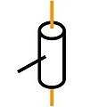

Torseur cinématique :
$$
\begin{Bmatrix}
\omega_x & v_x \\
0 & 0 \\
0 & 0
\end{Bmatrix}_M
$$

Torseur des actions mécaniques :
$$
\begin{Bmatrix}
0 & 0 \\
Y & M \\
Z & N
\end{Bmatrix}_M
$$

##### Pivot
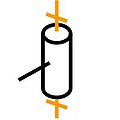

Torseur cinématique :
$$
\begin{Bmatrix}
0 & 0 \\
0 & 0 \\
\omega_z & 0
\end{Bmatrix}_M
$$

Torseur des actions mécaniques :
$$
\begin{Bmatrix}
X & L \\
Y & M \\
Z & 0
\end{Bmatrix}_M
$$

##### Glissière
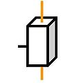

Torseur cinématique :
$$
\begin{Bmatrix}
0 & v_x \\
0 & 0 \\
0 & 0
\end{Bmatrix}_M
$$

Torseur des actions mécaniques :
$$
\begin{Bmatrix}
0 & L \\
Y & M \\
Z & N
\end{Bmatrix}_M
$$

##### Hélicoïdale
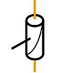

Torseur cinématique :
$$
\begin{Bmatrix}
\omega_x & p \cdot \omega_x \\
0 & 0 \\
0 & 0
\end{Bmatrix}_M
$$

Torseur des actions mécaniques :
$$
\begin{Bmatrix}
X & p \cdot X \\
Y & M \\
Z & N
\end{Bmatrix}_M
$$

##### Encastrement
Torseur cinématique :
$$
\begin{Bmatrix}
0 & 0 \\
0 & 0 \\
0 & 0
\end{Bmatrix}_M
$$

Torseur des actions mécaniques :
$$
\begin{Bmatrix}
X & L \\
Y & M \\
Z & N
\end{Bmatrix}_M
$$

#### Théorie des mécanismes


# SolidWorks
Ce document a été écrit en utilisant la version SolidWorks 2024.
## Installation

## Interface
À première vue, cette partie peut sembler inutile. Cependant, il y a **beaucoup** de menu et de barres dans SolidWorks. Et beaucoup d'entre elles sont imbriqués les unes dans les autres.

Lorsque l'on parcours un forum d'aide SolidWorks, il faut savoir où trouver les menus qui sont indiqué.
Voici le guide officiel solidworks. Il y a pleins de ressources utiles, mais il est difficile d'utilisation.  
[SolidWorks Web Help](https://help.solidworks.com/)  
La plupart des pages parlent de l'édition 2020 ou précédentes, cela peut parfois engendrer de la confusion.


Voici les noms important, qui peut être pertinent de connaître :

1. Barre de menus  (à survoler au curseur)
2. Barre d'outils accès rapide
3. Onglet / Barre d'outils
4. Barre de raccourcis
5. Volet de définition
6. Outils - Affichage (menu à "visée haute")
7. Outils - MotionManager
8. Menu contextuel

Il s'agit ici d'une configuration par défaut de SolidWorks 2024, mais il se peut que vous ayez tout de même une interface légèrement différente.

La plupart des menus SolidWorks sont customisable, ce qui veut dire qu'on peut choisir si ils sont actifs ou pas, et choisir les options présentes dans ces menus.

> Barre de menus > Outils > Personnaliser...  

 Cependant, la (1.) *Barre de menus* et la (2.) *Barre d'outils accès rapide* sont important et il est recommander de ne pas les modifier. Je recommande également de ne pas toucher aux onglets du (5.) *Volet de définition*

Sous SolidWorks, un outils (3. 6. 7.) est un ensemble de fonctions, regroupé sous une même catégorie.
Les outils peuvent avoir leur propre barre (6. 7.), où être incorporé dans la barre de raccourcis (3.).

La barre de raccourcis (4.) permet une customisation complète. Il est possible de créer ses propres onglets / barres d'outils, et de modifier les fonctions présentes sur chaque page.

Le menu contextuel (8.) s'affiche lors d'un clic droit de la souris. Il permet des réglages de caméra. Il est possible de faire un clic droit long pour afficher l'onglet mouvements de la souris. L'affichage de ce menu dépend du contexte dans lequel est le fichier ouvert. Voici les configurations par défaut possible :


Il peut y avoir des inconsistances sur le noms de certains menus, car certains ont changés de noms entre les forums (généralement édition 2020) et votre édition de SolidWorks. Les menus les plus important ont garder leur noms donc pas de panique.

## Configuration de base
### Contrôle du zoom
#### Explication
Il existe deux configurations possible lors de la projection des vues en dessin technique.

Le principe de la projection consiste à tracer un cube autour de la pièce et de projeter les vues sur chacunes des faces. Sur une mise en plan, on obtient l'image finale en "dépliant le cube".  
- **ASME (Convention américaine)**
    le plan de projection est entre l'objet et l'utilisateur.
- **ISO (Convention européenne)**
    l'objet est entre le plan de projection et l'utilisateur.  

La convention Européene a plus de sens lorsque l'on projette la pièce sur les faces du cube. On projette les faces sur le même côté que celle du cube.  
La convention Américaine est plus intuitive lorsqu'on lit un plan.  
Pour la convention américaine, il faut replier le cube et s'imaginer en train de le regarder devant soit. Pour la convention Européenne, il faut que l'observateur se place à l'intérieur de cube.  
Généralement pour la lecture d'un plan, il est plus simple de visualiser la pièce lorsque l'on est un observateur extérieur; mais ce n'est qu'une question d'habitude / de sens de lecture.

#### Réglage
Sur SolidWorks ce n'est pas génant, la seule différence sera lors de la création de mise en plan. Mais la direction du zoom avec la convention Européenne est inversée, et cela se reflète sur SolidWorks.
Pour changer ce paramètre dans SolidWorks :
> Barre d'outils accès rapide > Options (logo engrenage) > onglet Options du système > Vue > Cocher "Inverser la direction du zoom de la souris

### Thème couleur
Bien que l'implémentation ne soit pas super jolie, si vous souhaitez changer le thème couleur ("arrière plan") sur SolidWorks, vous pouvez aller dans :
> Barre d'outils accès rapide > Options (logo engrenage) > onglet Options du système > Couleurs

Ensuite vous avez un menu déroulant "*Arrière-plan*", où vous pouvez choisir "*Clair*", "*Moyennement éclairé*", "*Moyen*", "*Sombre*".  

Si vous scrollez un peu vous aurez aussi :
"*Apparence de l'arrière-plan*".  
Si vous souhaitez utiliser un thème autre que *clair*, vous ne pourrez pas utiliser l'arrière plan de la scène par défaut. Cependant, il est recommander de ne pas changer l'arrière plan de la scène car c'est parfois enregistré dans le fichier et ça peut être génant pour les autres.  
Je conseille donc de choisir une couleur unie (adapté pour faire des captures d'écrans) ou alors un dégradé. Vous pouvez aussi utiliser une image de fond customisé.

## Fonctions - Bases (placeholder?)
## Pièces - Avancé (placeholder?)
## Assemblage
## Importer des pièces
### Téléchargements
### Circuits imprimés (PCBs)
## Relations & dépendances
### Importation d'entités
### Création d'une librairie
## Conventions
### Nommage des fichiers
### Stockage
### Unités

# Impression 3D
## Astuces de modélisation
## Réglages logiciel
## Génération G-Code (slicing)
## Conventions
## Utilisation imprimante
## Matériaux

# Machine CNC
## Astuces de modélisation
## Conventions
## Utilisation de CamBam
## Conventions
## Formation FabLab
## Checklist
## Matériaux

# Mesures de sécurité
## Impression 3D
## Machine CNC
## Règles générales

# Bilan de l'année
## Résumé
## Points d'amélioration
## Conclusion

# Ressources complémentaires
## Engrenage

### Dentures imprimées en 3D
[3D Printing Gears – The Ultimate Guide](https://www.youtube.com/watch?v=EhzCQHOy3yw)

### Tracé d'un profile de dent pour engrenage.  
Méthode calculatoire  
[Making a Gear with Involute Teeth in Solidworks Tutorial](https://www.youtube.com/watch?v=22K6xWNwVLE)  
Méthode graphique  
[Spur Gear Design 2 - Involute of the circle](https://www.youtube.com/watch?v=gt_Ofn95ML0)  
[How to Make Gear with Involute Tooth Profile in Solidworks.](https://www.youtube.com/watch?v=QtvU87maN2U)  

### Cours Engrenage
[(1/1) : Cours des engrenages simplifié](https://web.enib.fr/~mecatro/edm/S3/1_engrenages/Cours%20des%20engrenages%20simplifi%C3%A9%20(1).pdf)  

[(1/3) : Involute Gears Explained](https://www.youtube.com/watch?v=nrsCoQN6V4M)  
[(2/3) : Undercut and Profile Shift](https://www.youtube.com/watch?v=TftOx_B1n2M)  
[(3/3) : Contact Ratio](https://www.youtube.com/watch?v=tcJ62ag9qgM)  

## Matériau
[Filament Property Table - Simplify 3D](https://www.simplify3d.com/resources/materials-guide/properties-table/)
## SolidWorks
### Dessin technique
[Dessin technique, Cours 1](https://geoffrio.xyz/Cours/destec/c1/c1.html)

